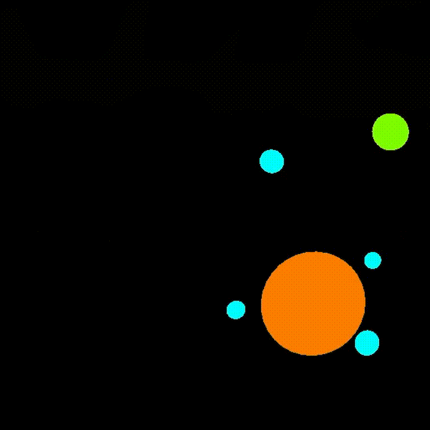

# OPENGL GRAVITY SIMULATOR
A simple program that simulates gravity between objects with varying mass while also handling their collision.

### Previous version of the program, 2D simulation :

 

### Current version of the program with 3D simulation : 

## Build 
`Linux :   g++ gravity_sim.cpp physics.cpp drawer.cpp -o gravity_sim -lglfw -lGLEW -lGL -lGLU -lm`  
`Windows : g++ gravity_sim.cpp physics.cpp drawer.cpp -o gravity_sim.exe -lglfw3 -lglew32 -lopengl32 -lglu32 -lgdi32`

