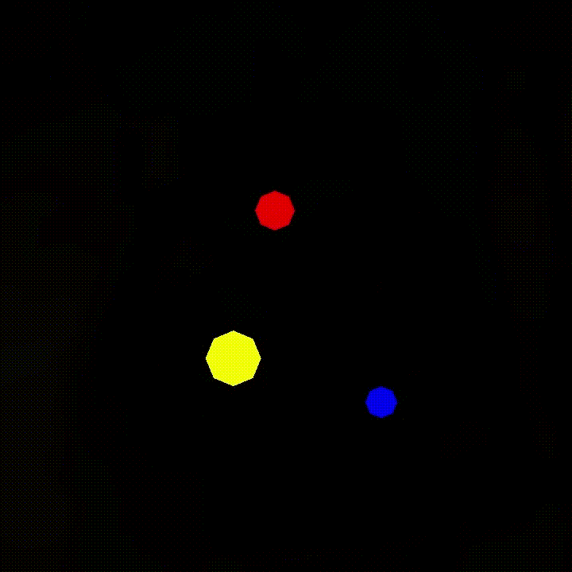
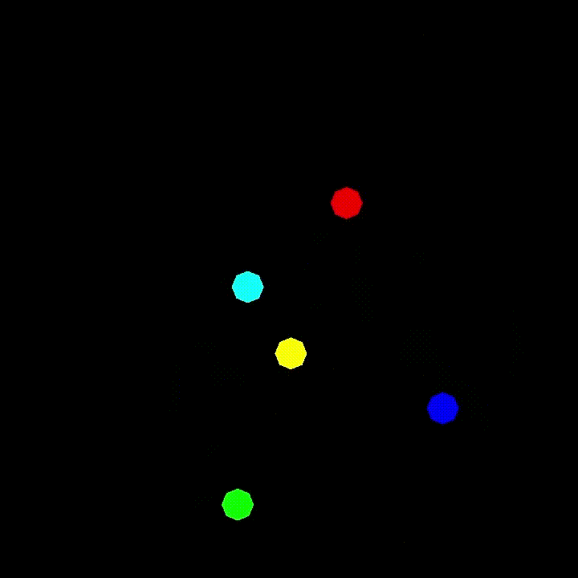

# OPENGL GRAVITY SIMULATOR
A simple program that simulates gravity between objects with varying mass while also handling their collision.
 
## Build 
`Linux :   g++ gravity_sim.cpp physics.cpp drawer.cpp -o gravity_sim -lglfw -lGL -lGLU -lm`  
`Windows : g++ gravity_sim.cpp physics.cpp drawer.cpp -o gravity_sim.exe -lglfw3 -lopengl32 -lglu32 -lgdi32`

### Work In Progess
Trying to implement this in 3D
